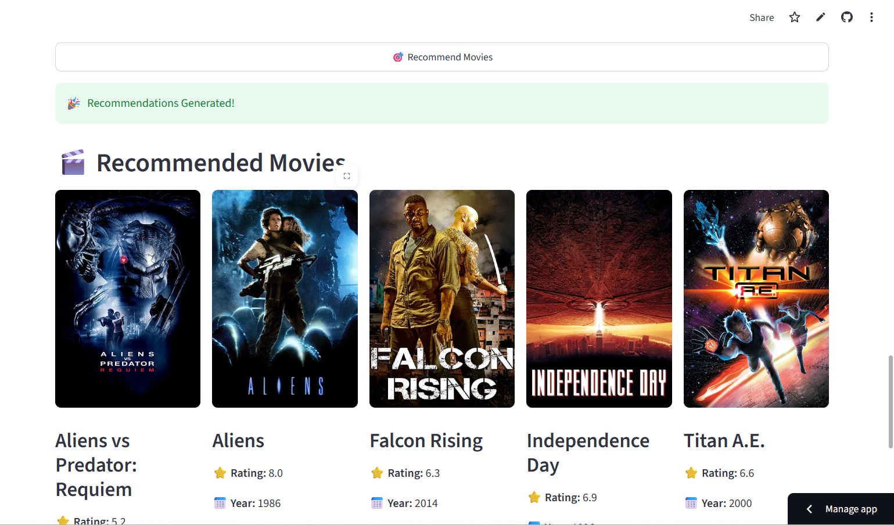

# 🎬 Movie Recommendation System

A Machine Learning-based web application that recommends movies based on the movie selected by the user.

The system uses **Content-Based Filtering** to find similar movies and provides detailed movie information such as ratings, release year, genre, director, cast, overview, and posters.

---

## 🚀 Live Demo

[Open Movie Recommendation System](https://putta-jyothi-movie.streamlit.app/)

---

## 📸 Screenshots

### 🏠 Home Page


### 🎬 Movie Recommendations



### 📊 Dashboard


### ❤️ Watchlist


---

## 📌 Project Overview

The **Movie Recommendation System** is an interactive web application that helps users discover movies based on their interests.

Users can select a movie from the available movie collection, and the system recommends the **Top 5 similar movies** using Content-Based Filtering and Cosine Similarity.

The application also provides detailed movie information, an interactive dashboard, and a watchlist feature.

---

## ✨ Features

### 🎬 Movie Recommendations

- Content-Based Movie Recommendation
- Recommends Top 5 similar movies
- Uses Cosine Similarity
- Movie search and selection
- Displays recommended movie posters

### 🔎 Movie Search

- Search and select movies easily
- Select a movie from the available movie collection
- Get recommendations based on the selected movie

### ⭐ Movie Ratings

- Displays movie ratings
- Shows rating information for selected and recommended movies
- Rating distribution available in the dashboard

### 📅 Release Information

- Displays movie release year
- Shows movie release date
- Provides movies-by-year visualization

### 🎭 Genre Information

- Displays movie genres
- Allows users to explore genre information
- Provides genre-based statistics in the dashboard

### 🎬 Director Information

- Displays the director of the selected movie
- Director information is retrieved from movie data

### 👥 Cast Information

- Displays cast information
- Provides details about actors associated with the movie

### 📝 Movie Overview

- Displays a description of the selected movie
- Helps users understand the movie before watching

### 🖼️ Movie Posters

- Displays movie posters
- Posters are retrieved using the TMDB API

### ❤️ Watchlist

- Add movies to a personal watchlist
- View saved movies
- Display movie information in the watchlist
- Easily keep track of movies to watch later

### 📊 Interactive Dashboard

The dashboard provides useful movie statistics including:

- Total number of movies
- Average rating
- Highest-rated movies
- Rating distribution
- Movies by release year
- Movies by genre
- Top-rated movies

---

## 🧠 Machine Learning

The recommendation system uses **Content-Based Filtering**.

### How It Works

```text
User selects a movie
        ↓
Movie features are extracted
        ↓
Movie features are processed
        ↓
Movie features are converted into numerical representation
        ↓
Cosine Similarity is calculated
        ↓
Movies are ranked based on similarity
        ↓
Top 5 similar movies are displayed
