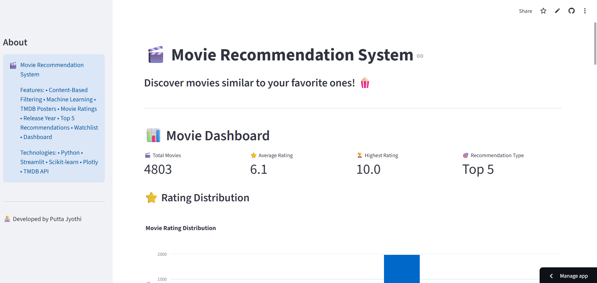
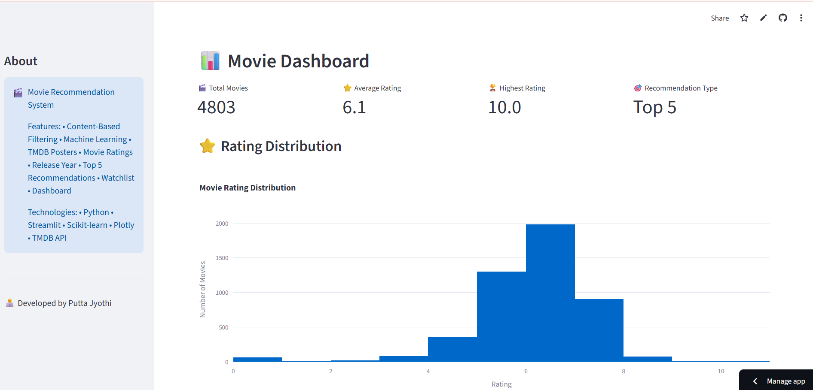
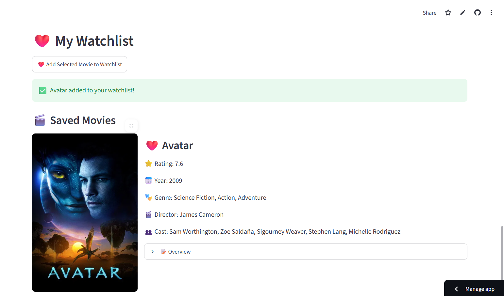

# 🎬 Movie Recommendation System

A Machine Learning-based web application that recommends movies based on the movie selected by the user.

The system uses **Content-Based Filtering** to find similar movies and provides useful movie information such as ratings, release year, genre, director, cast, overview, and posters.

---

## 🚀 Live Demo

[Open Movie Recommendation System](https://putta-jyothi-movie.streamlit.app/)

---

## 📸 Screenshots

### 🏠 Home Page



### 🎬 Movie Recommendations


### 📊 Dashboard



### ❤️ Watchlist



---
## 📌 Project Overview

The Movie Recommendation System is an interactive web application designed to help users discover movies based on their interests.

When a user selects a movie, the system analyzes different movie features and calculates similarity with other movies. Based on the similarity score, the application recommends the **Top 5 similar movies**.

Users can also explore movie details, manage a watchlist, and view statistics through an interactive dashboard.

---

## ✨ Features

- 🎬 Content-Based Movie Recommendation
- 🔎 Movie Search
- 🎯 Top 5 Similar Movies
- ⭐ Movie Ratings
- 📅 Release Year
- 🎭 Genre
- 🎬 Director
- 👥 Cast
- 📝 Movie Overview
- 🖼️ Movie Posters
- ❤️ Watchlist
- 📊 Interactive Dashboard
- 📈 Rating Distribution
- 📅 Movies by Release Year
- 🎭 Movies by Genre
- 🏆 Top Rated Movies

---

## 🧠 Machine Learning

The recommendation system uses **Content-Based Filtering**.

### How It Works

```text
User selects a movie
        ↓
Movie features are extracted
        ↓
Movie features are converted into numerical representation
        ↓
Similarity is calculated using Cosine Similarity
        ↓
Movies are ranked based on similarity
        ↓
Top 5 similar movies are displayed
```

### 🎯 Cosine Similarity

Cosine Similarity is used to measure how similar two movies are based on their feature vectors.

A higher similarity score indicates that the movies have more similar characteristics.

---

## 🛠️ Technologies Used

| Technology | Purpose |
|---|---|
| Python | Programming language |
| Streamlit | Web application and user interface |
| Pandas | Data processing |
| NumPy | Numerical operations |
| Scikit-learn | Machine Learning and similarity calculation |
| Plotly | Interactive data visualization |
| TMDB API | Movie information and posters |
| Pickle | Saving and loading processed models |

---

## 📂 Dataset

The project uses the **TMDB 5000 Movie Dataset**.

### Dataset Files

- `tmdb_5000_movies.csv`
- `tmdb_5000_credits.csv`

The dataset contains information such as:

- Movie title
- Genres
- Cast
- Director
- Ratings
- Release date
- Overview

---

## 📊 Dashboard

The application provides an interactive dashboard with:

- 📊 Total number of movies
- ⭐ Rating distribution
- 📅 Movies by release year
- 🎭 Movies by genre
- 🏆 Top-rated movies

---

## ❤️ Watchlist

The Watchlist feature allows users to save movies they are interested in.

Users can view saved movies along with available movie information such as:

- Rating
- Release year
- Genre
- Director
- Cast
- Overview

---

## 🎞️ Movie Details

For selected movies, the application displays:

- Movie poster
- Movie title
- Rating
- Release date
- Release year
- Genre
- Director
- Cast
- Overview

Movie information and posters are retrieved using the **TMDB API**.

---

## 🔐 API Key Security

The TMDB API key is stored securely using **Streamlit Secrets**.

The API key is not included directly in the source code or GitHub repository.

The `.streamlit/secrets.toml` file is excluded using `.gitignore`.

---

## 🎯 Project Objective

The objective of this project is to develop an interactive movie recommendation system that helps users discover movies based on their interests using Machine Learning techniques.

The project demonstrates the practical use of:

- Machine Learning
- Content-Based Filtering
- Cosine Similarity
- Data Processing
- Data Visualization
- API Integration
- Web Application Development

---

## 🔮 Future Enhancements

- 👤 User accounts and personalized profiles
- 🎯 Personalized recommendations
- 🎞️ Movie trailers
- 🔍 Advanced movie filtering
- 📚 Improved recommendation algorithms
- ❤️ Persistent user watchlists
- ⭐ User ratings and reviews
- 🤖 Hybrid recommendation system

---

## 👩‍💻 Developer

**Putta Jyothi**

B.Tech — CAI

---

## 📜 License

This project is developed for educational and portfolio purposes.
